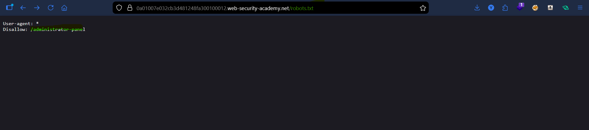
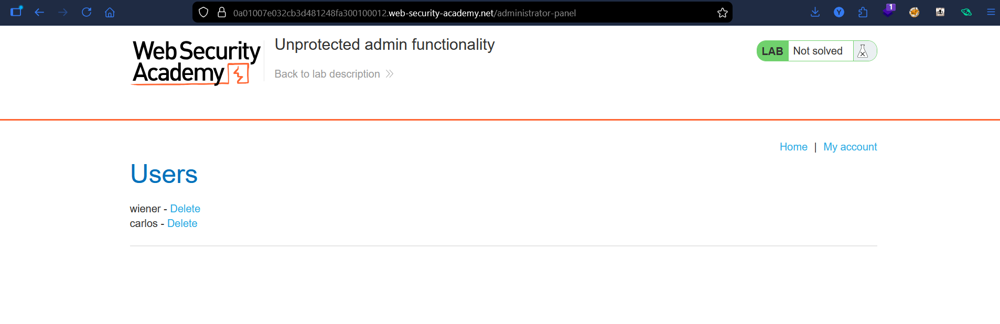
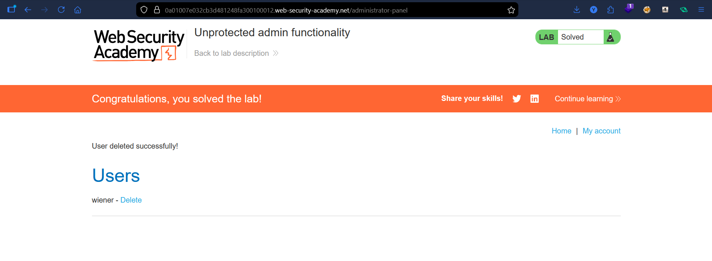

# Lab: Unprotected Admin Functionality

## Vulnerability
The admin panel has no access control — anyone can reach it without authentication.

## Exploit

### Step 1 — Check robots.txt
Navigated to `/robots.txt` and found:
```
Disallow: /administrator-panel
```

### Step 2 — Access the admin panel
Went directly to `/administrator-panel` — no login required, full access granted.

### Step 3 — Delete the user
Deleted user `carlos` from the users list → lab solved.

## Key Point
- `robots.txt` is public — it accidentally reveals hidden paths
- No authentication on the admin panel = anyone can access it

## Proof



