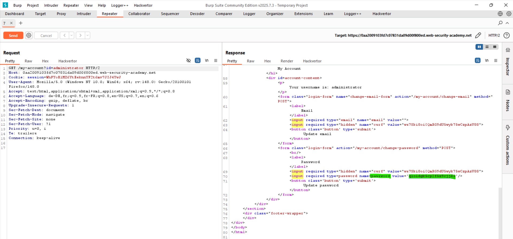
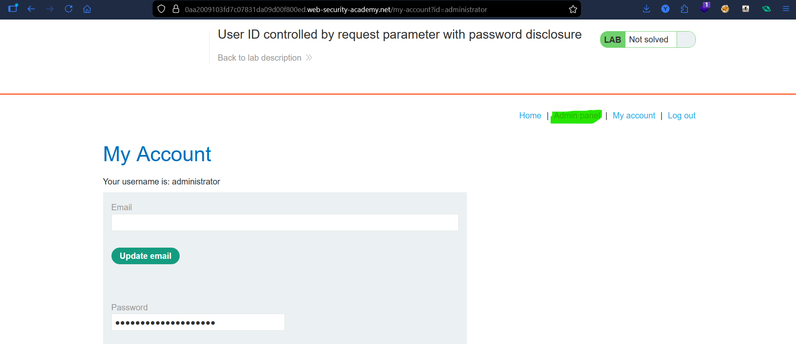
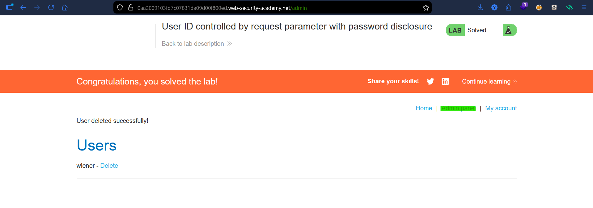

# Lab: User ID Controlled by Request Parameter With Password Disclosure

## Vulnerability
The account page pre-fills the user's password in a masked input field. Since the `id` parameter is user-controlled with no authorization check, changing it to another user's id leaks their password.

## Exploit

### Step 1 — Change the id to administrator
Logged in as `wiener:peter`. Changed the URL parameter to:
```
GET /my-account?id=administrator
```

### Step 2 — Read the password
Page loaded the administrator's account — password was visible in the masked input field in the page source.

### Step 3 — Login as administrator
Used the leaked password to log in as `administrator`.

### Step 4 — Delete carlos
Navigated to `/admin` and deleted `carlos` → lab solved.

## Key Point
- Password pre-filled in a hidden input is still in the HTML source — never do this
- No authorization check on the `id` parameter = any user can access any account
- Combining IDOR with sensitive data exposure leads to full account takeover

## Proof




