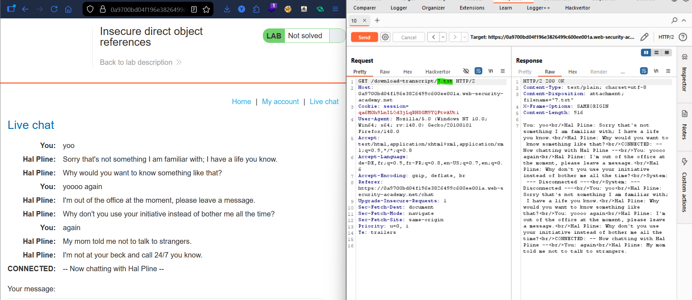
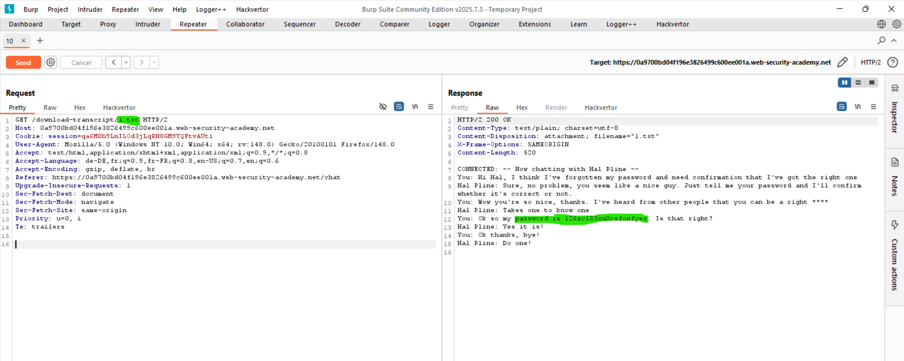
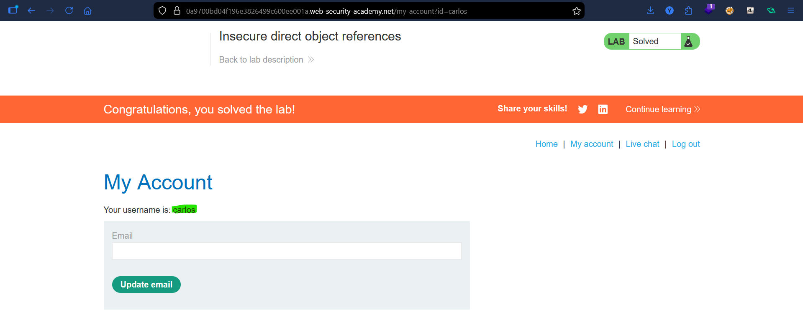

# Lab: Insecure Direct Object References (IDOR)

## Vulnerability
Chat transcripts are stored as static files on the server with sequential filenames (`1.txt`, `2.txt`...). No authorization check is done — anyone can access any transcript by guessing the filename.

## Exploit

### Step 1 — Find the transcript URL
Went to **Live chat**, sent a message, then clicked **View transcript**. Noticed the download URL:
```
GET /download-transcript/7.txt
```

### Step 2 — Access carlos's transcript
Changed the filename to `1.txt`:
```
GET /download-transcript/1.txt
```
Response contained a full chat log where carlos's **password was leaked** in plain text.

### Step 3 — Login as carlos
Used the stolen password to log in as `carlos` → lab solved.

## Key Point
- Files stored with predictable sequential names are easy to enumerate
- No authorization check = any user can access any file
- Never store sensitive files with guessable names and always verify the requester owns the resource

## Proof



