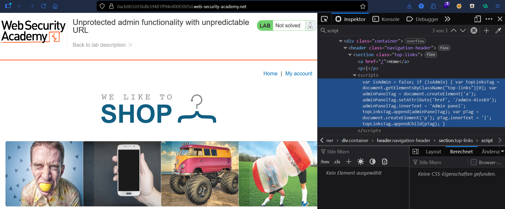
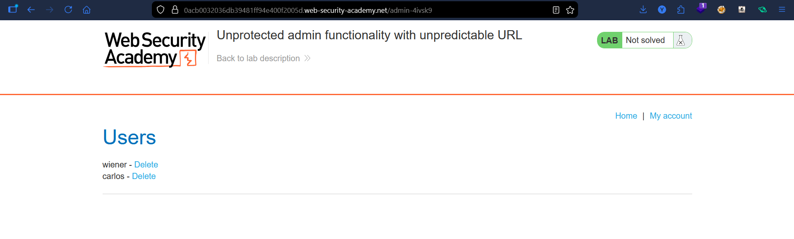
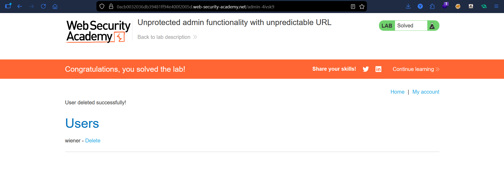

# Lab: Unprotected Admin Functionality With Unpredictable URL

## Vulnerability
The admin panel URL is randomized but leaked inside the page's JavaScript source code — anyone who reads it can access the panel directly.

## Exploit

### Step 1 — Find the URL in page source
Opened DevTools → Inspector and searched for `script`. Found the admin path hardcoded in the JS:
```javascript
var isAdmin = false;
adminPanelTag.setAttribute('href', '/admin-4ivsk9');
```

### Step 2 — Access the admin panel
Navigated directly to `/admin-4ivsk9` — no authentication required.

### Step 3 — Delete the user
Deleted user `carlos` → lab solved.

## Key Point
- A "secret" URL is not access control — if it's in the client-side code, anyone can find it
- Always check page source and JS files for leaked paths

## Proof



