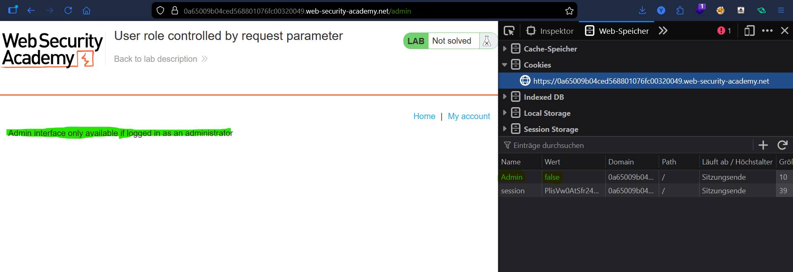
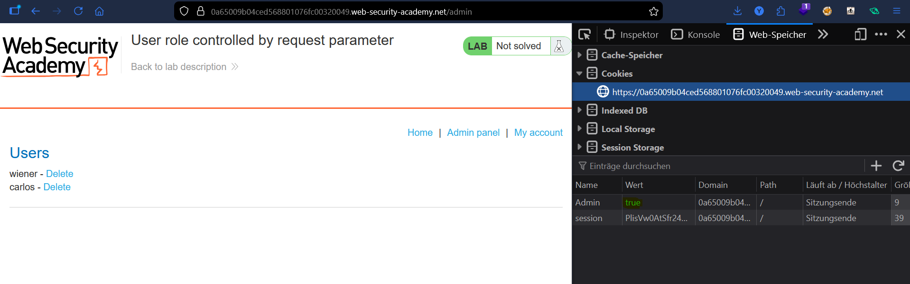
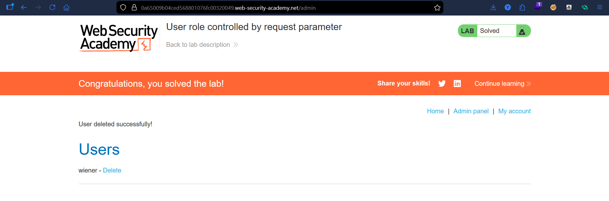

# Lab: User Role Controlled by Request Parameter

## Vulnerability
The admin role is controlled by a cookie called `Admin` set to `true` or `false`. Since cookies are client-side, any user can modify them to gain admin access.

## Exploit

### Step 1 — Find the cookie
Navigated to `/admin` and opened **DevTools → Storage → Cookies**. Found:
```
Admin = false
```

### Step 2 — Change the cookie
Changed the `Admin` cookie value from `false` to `true` and refreshed the page → full admin access granted.

### Step 3 — Delete the user
Deleted user `carlos` → lab solved.

## Key Point
- Never trust client-side values for access control
- A cookie is just a value the user can edit — it should never decide who is an admin

## Proof



