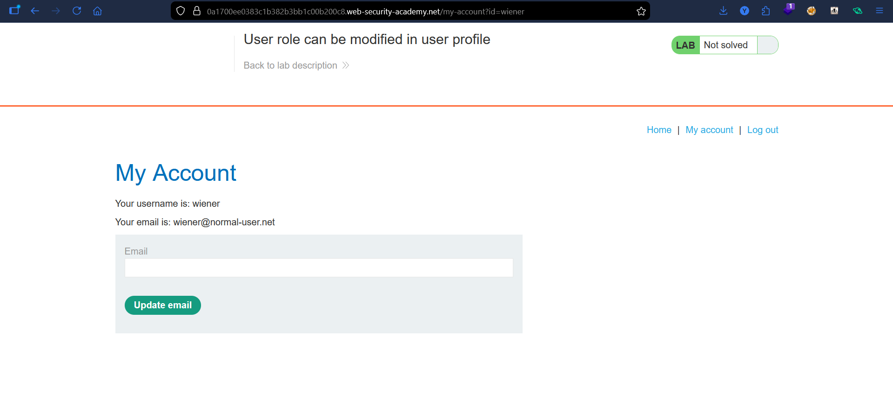
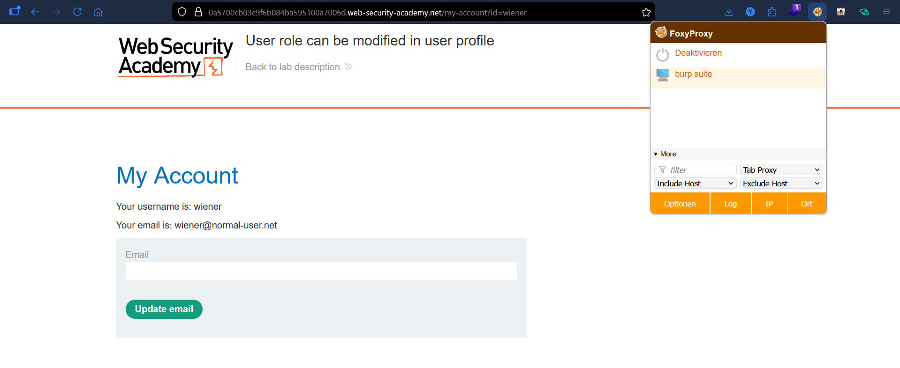
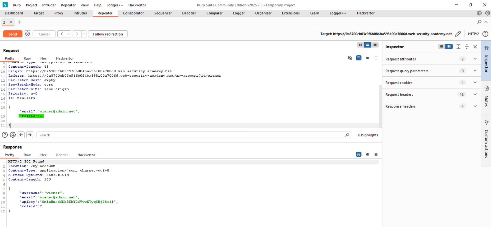
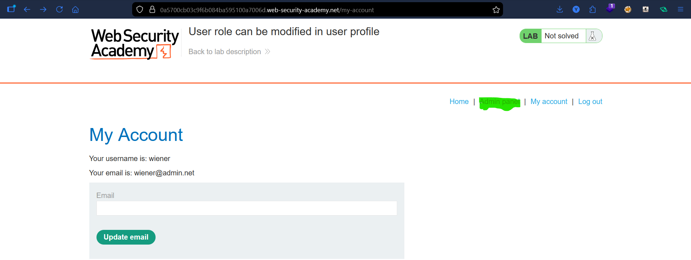
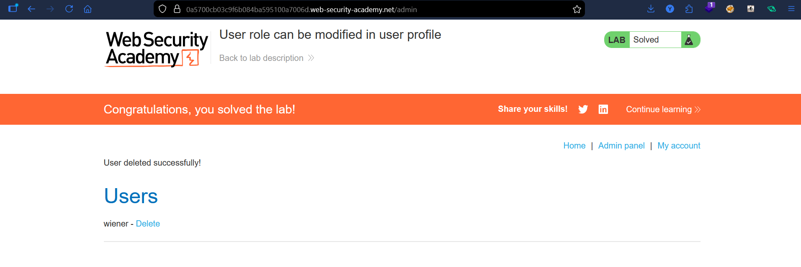

# Lab: User Role Can Be Modified in User Profile

## Vulnerability
The `roleid` field in the email update request is accepted and processed by the server without validation — any user can escalate their own role by adding it to the request body.

## Exploit

### Step 1 — Capture the request
Logged in as `wiener` and updated the email. Captured the POST request in **Burp Suite → HTTP History** and sent it to **Repeater**.

### Step 2 — Add roleid to the request
In Repeater, modified the request body from:
```json
{"email":"wiener@admin.net"}
```
to:
```json
{"email":"wiener@admin.net","roleid":2}
```

### Step 3 — Confirm role change
Sent the request — response confirmed:
```json
{"roleid":2}
```
Refreshed the page → **Admin panel** appeared in the navbar.

### Step 4 — Delete the user
Navigated to `/admin` and deleted `carlos` → lab solved.

## Key Point
- The server blindly accepts any field sent in the request body
- Never trust user-supplied data for role or privilege assignment — roles must be enforced server-side

## Proof





