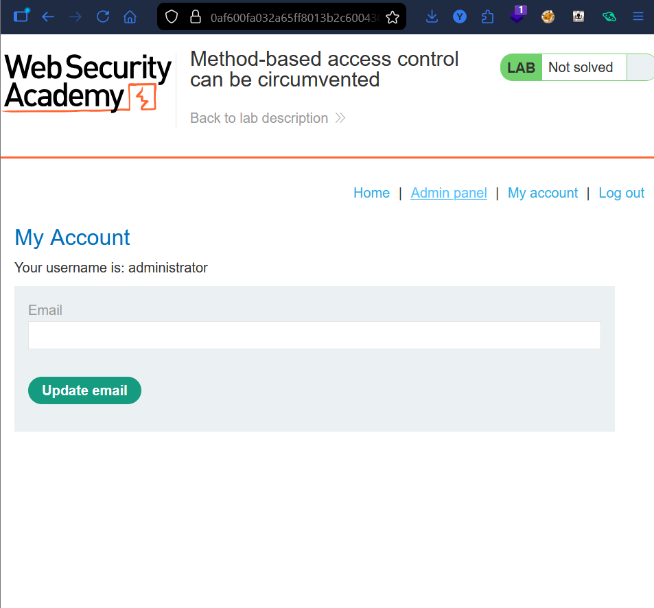
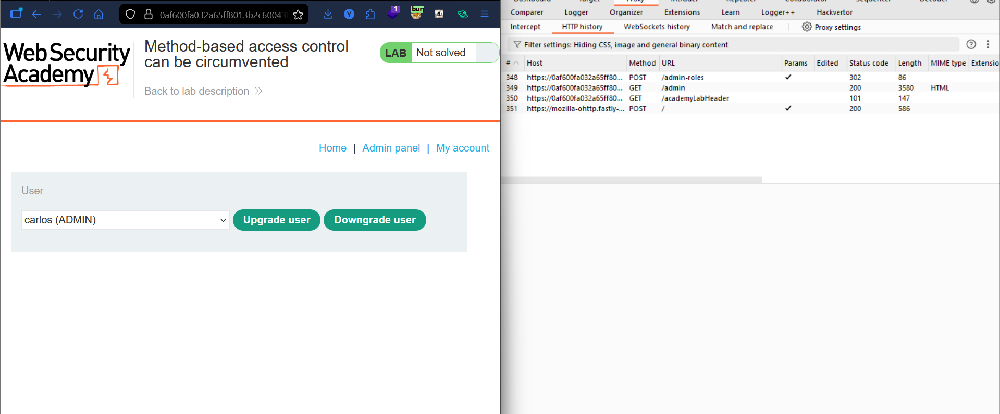
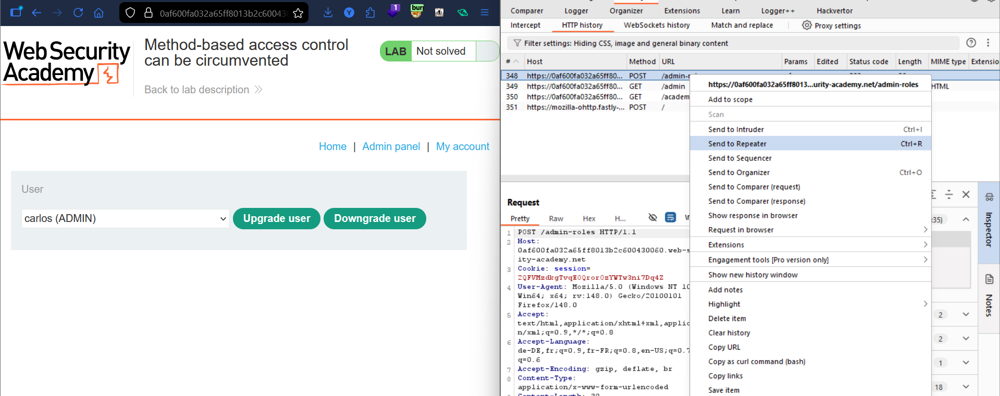
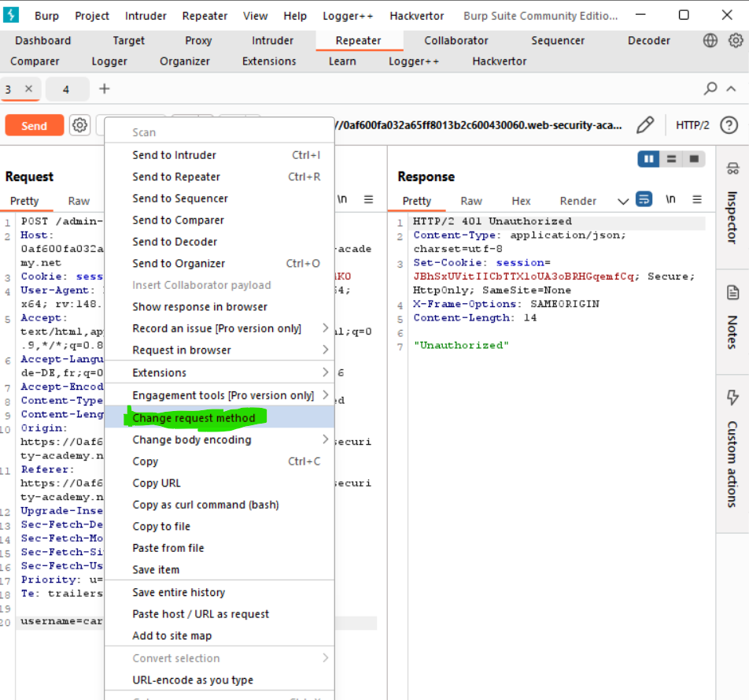
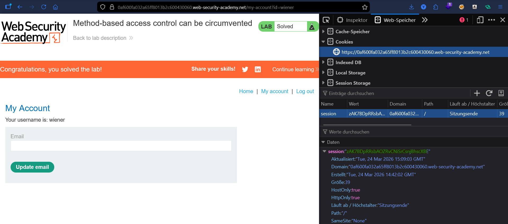
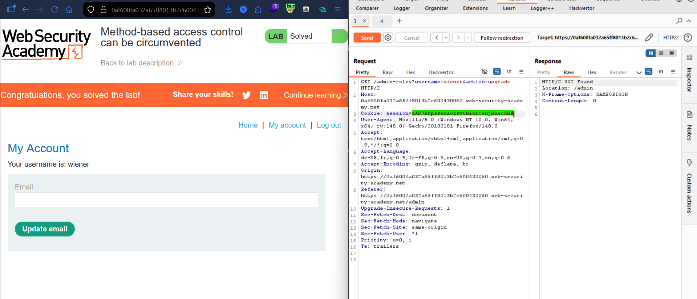

# Lab: Method-Based Access Control Can Be Circumvented

## Vulnerability
The server enforces access control on `POST` requests to `/admin-roles` but fails to apply the same check on `GET` requests — allowing a low-privilege user to upgrade their own role by simply switching the HTTP method.

## Exploit

### Step 1 — Capture the admin request
Logged in as `administrator:admin`, went to the admin panel and upgraded `carlos`. Captured the `POST /admin-roles` request in **Burp HTTP History** → sent to Repeater.

### Step 2 — Get wiener's session cookie
Logged in as `wiener:peter` in an incognito window. Opened **DevTools → Storage → Cookies** and copied wiener's session cookie.

### Step 3 — Swap the cookie
In Repeater, replaced the admin session cookie with wiener's cookie → sent the POST request → got `401 Unauthorized`.

### Step 4 — Change the method
Right clicked in Repeater → **Change request method** → converted to GET. Changed `username=carlos` to `username=wiener` → sent the request → got `302 Found` → lab solved.

## Result
Wiener was promoted to admin by sending a GET request — the server only checked access control on POST.

## Key Point
- Access control must be enforced on **every HTTP method** — not just POST
- Switching from POST to GET bypassed the restriction entirely
- Always test alternate HTTP methods when you get `401` or `403`

## Proof

