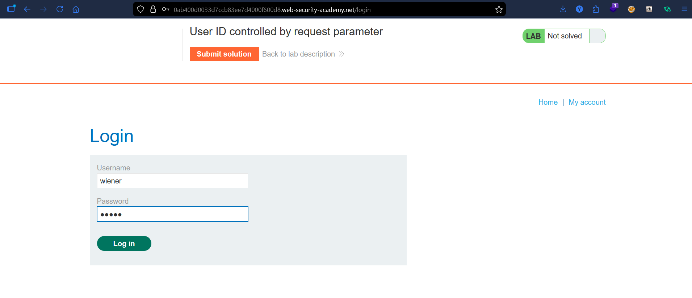
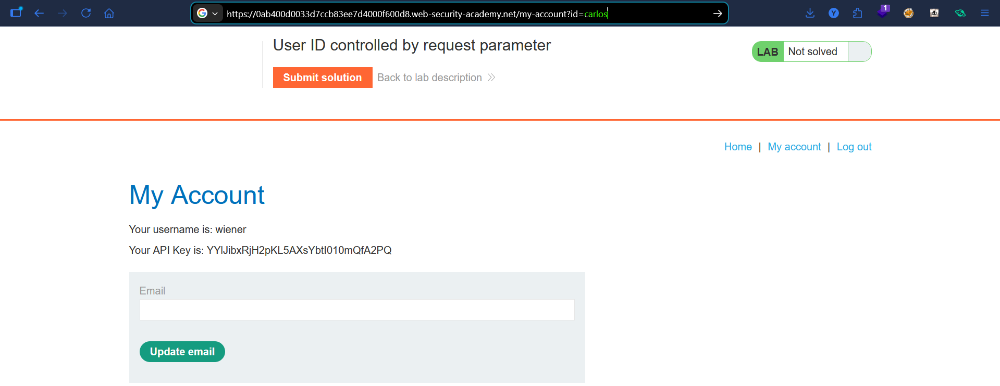
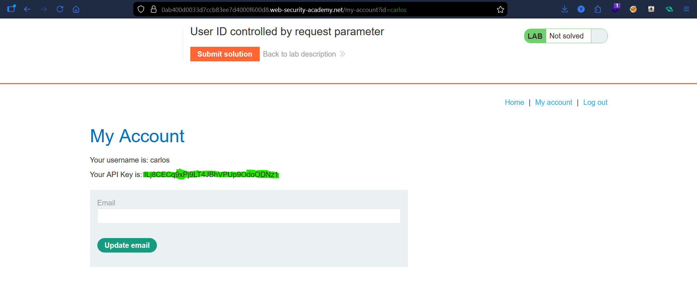
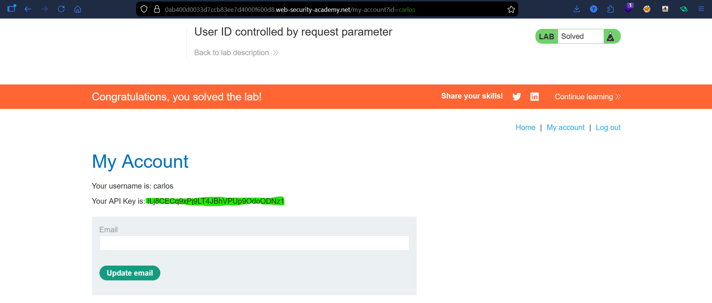

# Lab: User ID Controlled by Request Parameter

## Vulnerability
The application uses a user-controlled `id` parameter in `/my-account` to retrieve account data without verifying ownership, allowing any authenticated user to access other users' accounts by modifying the parameter — resulting in horizontal privilege escalation (IDOR).

## Exploit
### Step 1 — Log in
```
wiener:peter
```

### Step 2 — Observe URL
```
/my-account?id=wiener
```

### Step 3 — Modify parameter
```
/my-account?id=carlos
```


### Step 4 — Access data
Loaded the page and retrieved Carlos's account including API key.

### Step 5 — Submit
Submitted the API key → lab solved.

## Result
Unauthorized access to another user's account by parameter manipulation.

## Key Point
- Never trust user input for access control  
- Enforce authorization server-side  
- Validate object ownership  
- Classic IDOR vulnerability  

## Proof







