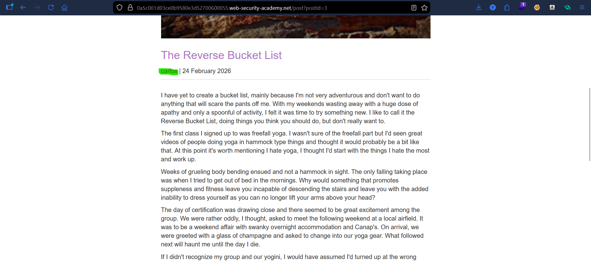
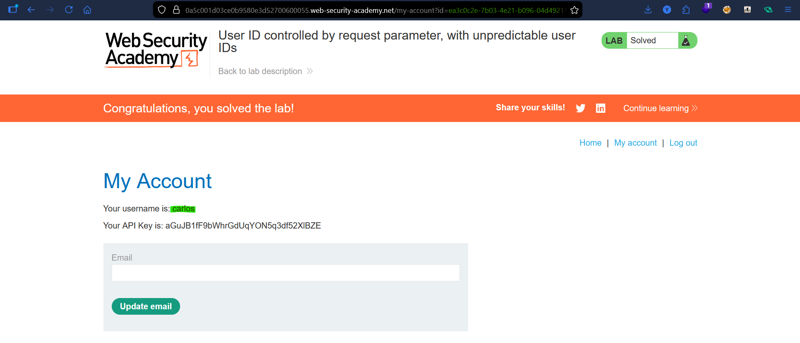

# Lab: User ID Controlled by Request Parameter

## Vulnerability
The application uses a user-controlled `id` parameter to display account data but fails to verify the logged-in user is authorized to view other users' information.

## Exploit

### Step 1 — Login as wiener
Logged in with `wiener:peter` and noticed the account page URL:
```
GET /my-account?id=wiener
```

### Step 2 — Change the id to carlos
Simply changed the `id` parameter in the URL to `carlos`:
```
GET /my-account?id=carlos
```
Response returned carlos's account page including his **API key**.

### Step 3 — Submit the API key
Copied carlos's API key and submitted it → lab solved.

## Result
Horizontal privilege escalation by changing a single parameter in the URL — no authentication bypass needed.

## Key Point
- The server never checks if the logged-in user matches the requested `id`
- Any user can view any other user's data just by changing the URL parameter
- This is a classic **IDOR** (Insecure Direct Object Reference)

## Proof



