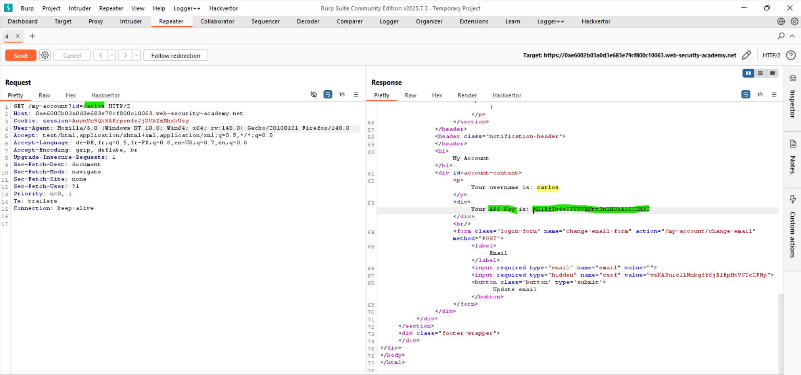

# Lab: User ID Controlled by Request Parameter With Data Leakage in Redirect

## Vulnerability
The server redirects unauthorized users away from protected pages — but still includes the sensitive page content in the **body of the redirect response** before sending it.

## Exploit

### Step 1 — Login and capture the request
Logged in as `wiener:peter` and navigated to `/my-account?id=wiener`. Sent to Burp Repeater.

### Step 2 — Change the id to carlos
Changed the parameter to:
```
GET /my-account?id=carlos
```

### Step 3 — Read the redirect response body
Server returned `302 redirect` — but the response body contained carlos's full account page including his **API key**.

### Step 4 — Submit the API key
Copied the API key from the response body and submitted it → lab solved.

## Key Point
- The server redirects unauthorized requests but **renders the page first** — leaking data in the 302 response body
- Browsers follow the redirect and never show the body — but Burp captures it
- Always check redirect response bodies for leaked sensitive data

## Proof



