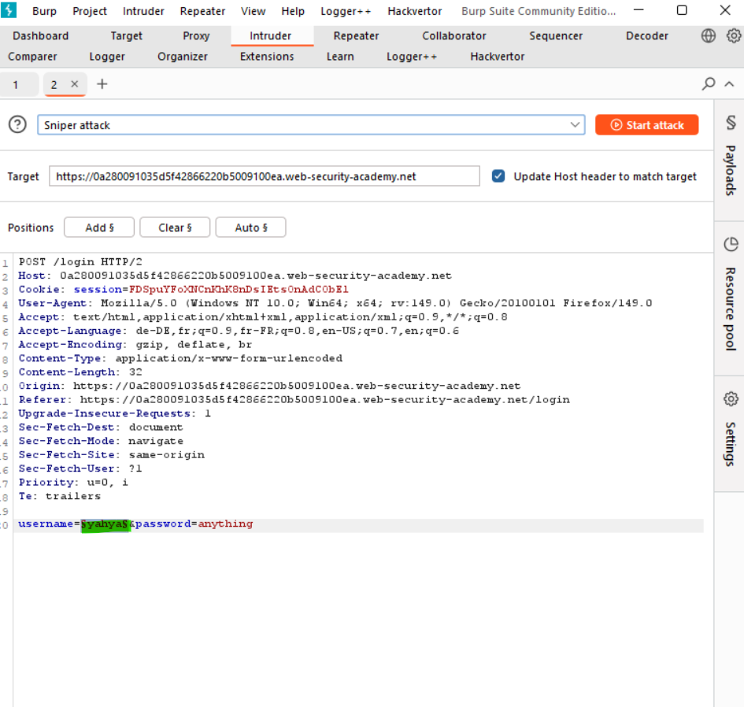
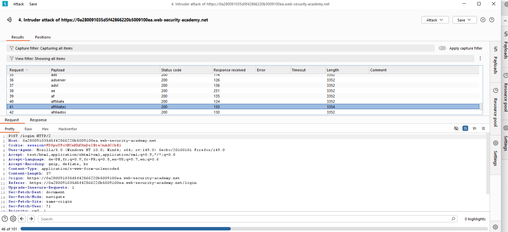
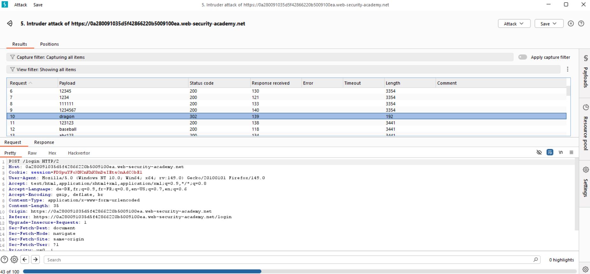
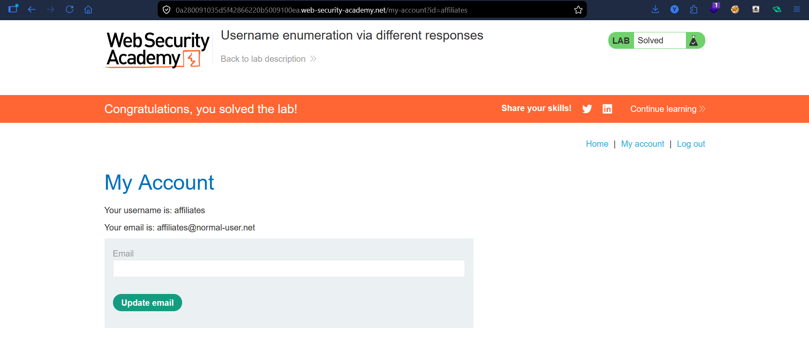

# Lab: Username Enumeration via Different Responses

## Vulnerability
The login form returns different responses depending on whether the username exists or not — allowing an attacker to enumerate valid usernames and then brute-force the password.

## Exploit

### Step 1 — Enumerate valid username
Captured the login POST request and sent it to **Burp Intruder**. Set the username field as the payload position:
```
username=§yahya§&password=anything
```
Loaded a username wordlist and ran a **Sniper attack**. Looked for a response with a different **length** — indicating a different error message.

Found that username `affiliates` returned a slightly different response length → valid username confirmed.

### Step 2 — Brute-force the password
Kept the valid username and set the password field as the payload position. Ran another Sniper attack with a password wordlist.

Found that password `dragon` returned a different response length → successful login.

### Step 3 — Login
Used the credentials `affiliates:dragon` to login → lab solved.

## Key Point
- Different error messages for wrong username vs wrong password leak which usernames exist
- Always return the same generic message for failed logins regardless of the reason
- Response **length** and **status code** differences are enough to enumerate users

## Proof




