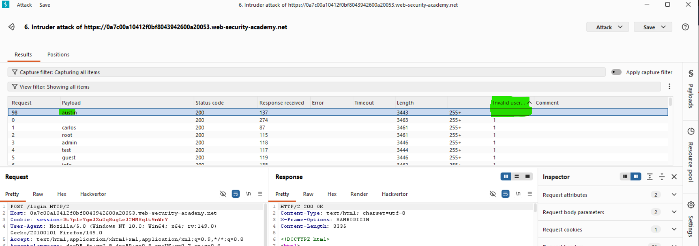
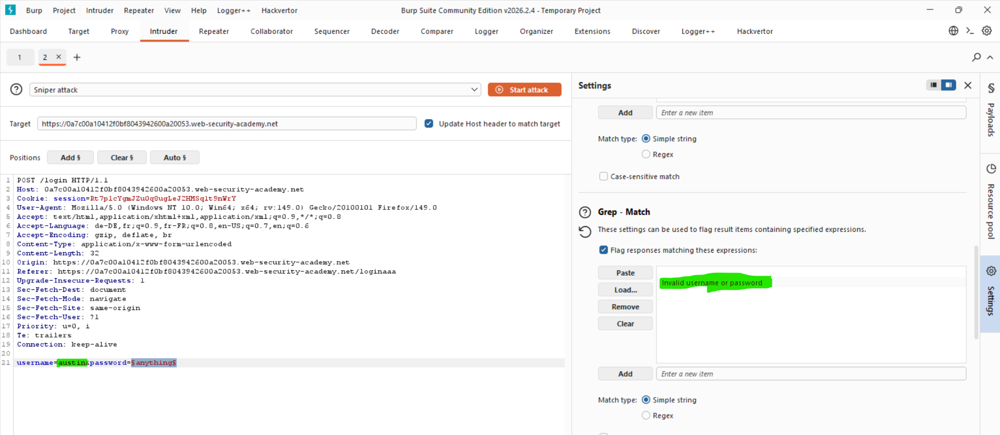
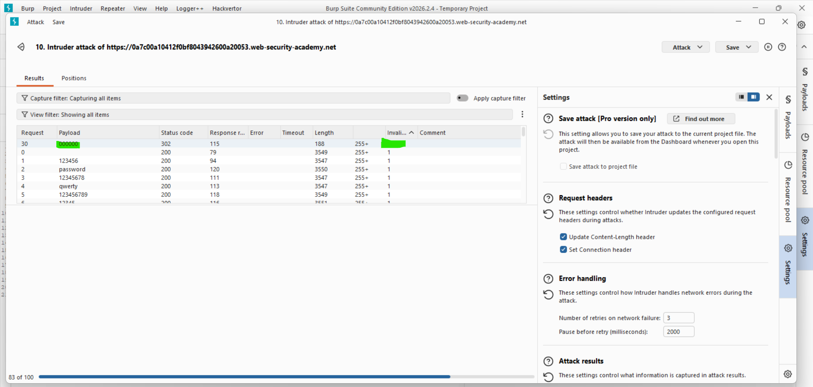
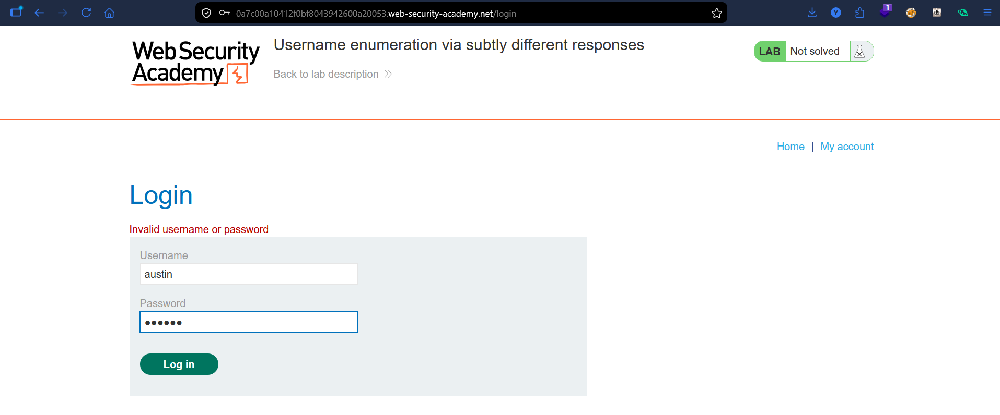
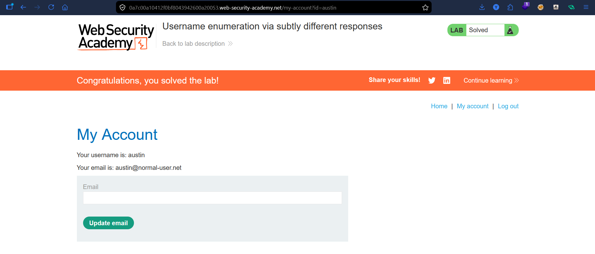

# Lab: Username Enumeration via Subtly Different Responses

## Vulnerability
The login form returns almost identical error messages for all failed attempts — but for one valid username the message is **subtly different**, revealing it as valid.

## Exploit

### Step 1 — Enumerate valid username
Captured the login POST request and sent it to **Burp Intruder**. Set the username as the payload position:
```
username=§yahya§&password=anything
```
In **Settings → Grep - Match**, added the error message:
```
Invalid username or password
```
Ran the Sniper attack with the username wordlist. Most responses were flagged with a match — but `austin` had **no match** → meaning its error message was slightly different → valid username confirmed.

### Step 2 — Brute-force the password
Fixed the username to `austin` and set the password as the payload position:
```
username=austin&password=§anything§
```
Ran another Sniper attack with the password wordlist. Found that password `000000` returned a **302 redirect** → successful login.

### Step 3 — Login
Used `austin:000000` to login → lab solved.

## Key Point
- All failed logins return the same message **except** for valid usernames — the message differs subtly
- **Grep - Match** flags responses containing the error — a missing flag = different response = valid username
- Even invisible differences like a trailing space are enough to enumerate users

## Proof





