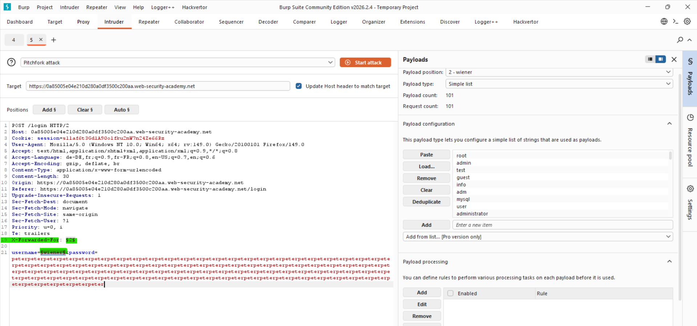
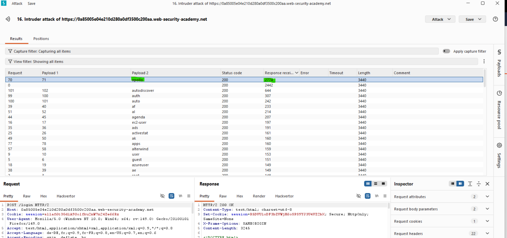
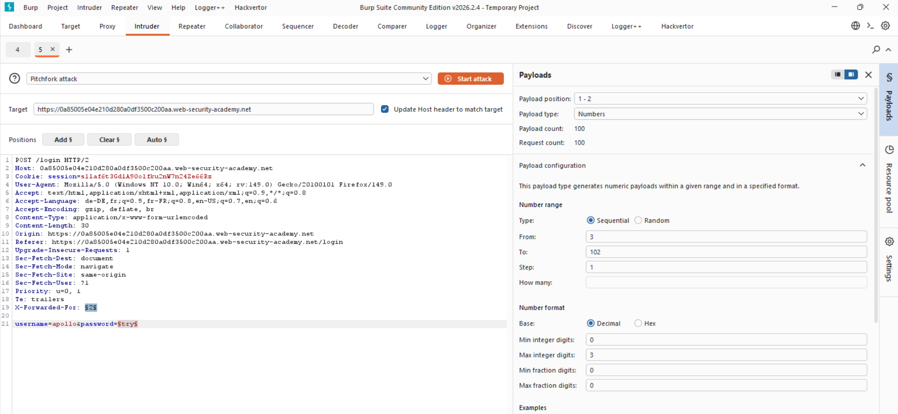
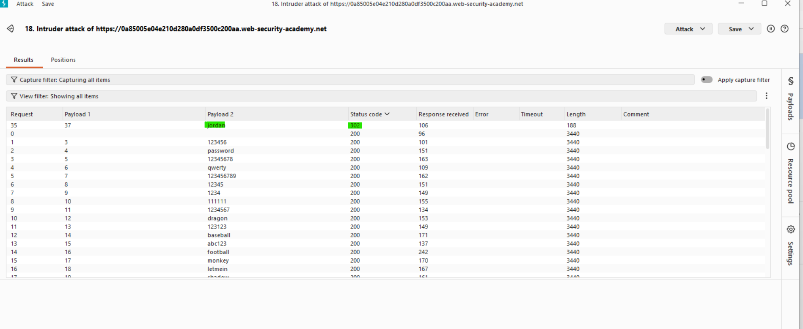
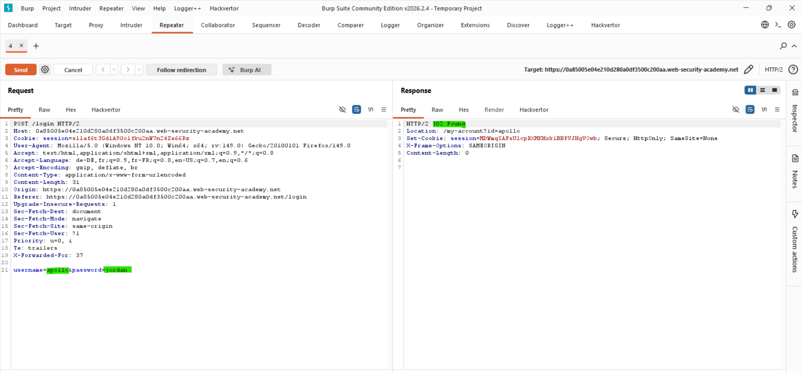
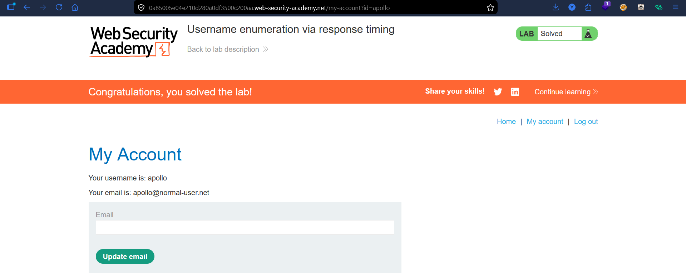

# Lab: Username Enumeration via Response Timing

## Vulnerability
The server takes longer to respond when a valid username is submitted — because it actually processes the password check. For invalid usernames it rejects immediately. This timing difference leaks valid usernames. The app also blocks IPs after too many attempts, bypassed using `X-Forwarded-For`.

## Exploit

### Step 1 — Setup the Pitchfork attack
Captured the login POST request and sent it to **Burp Intruder**. Set attack type to **Pitchfork** with two payload positions:
```
X-Forwarded-For: §1§
username=§wiener§&password=peterpeterpeter...(very long string)
```
- **Payload 1** → Numbers 1-100 (to fake a new IP each request and bypass lockout)
- **Payload 2** → Username wordlist

The long password forces the server to spend more time hashing it when the username is valid — making the timing difference more visible.

### Step 2 — Identify valid username
Ran the attack and sorted results by **Response received** column. Username `apollo` had a significantly higher response time of **2774ms** compared to all others → valid username confirmed.

### Step 3 — Brute-force the password
Fixed username to `apollo` and set up a new Pitchfork attack:
```
X-Forwarded-For: §1§
username=apollo&password=§try§
```
- **Payload 1** → Numbers 3-102
- **Payload 2** → Password wordlist

Found that password `jordan` returned a **302 redirect** → successful login confirmed in Repeater.

### Step 4 — Login
Used `apollo:jordan` to login → lab solved.

## Key Point
- The server leaks valid usernames through **response timing** — not error messages
- IP-based rate limiting is bypassed using `X-Forwarded-For` with a different number per request
- A very long password amplifies the timing difference making valid usernames easier to spot
- Always sort by **Response received** time when doing timing-based attacks

## Proof






