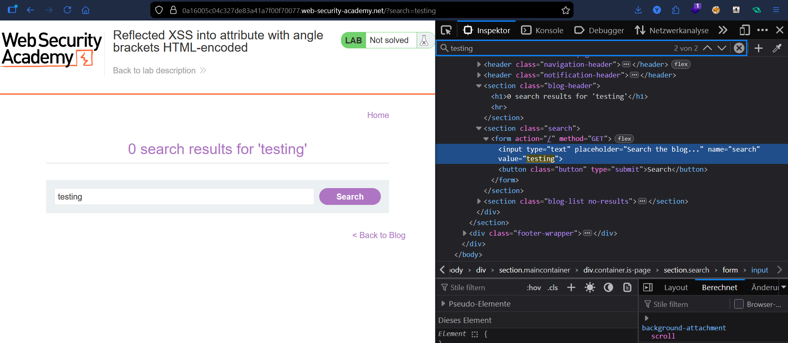
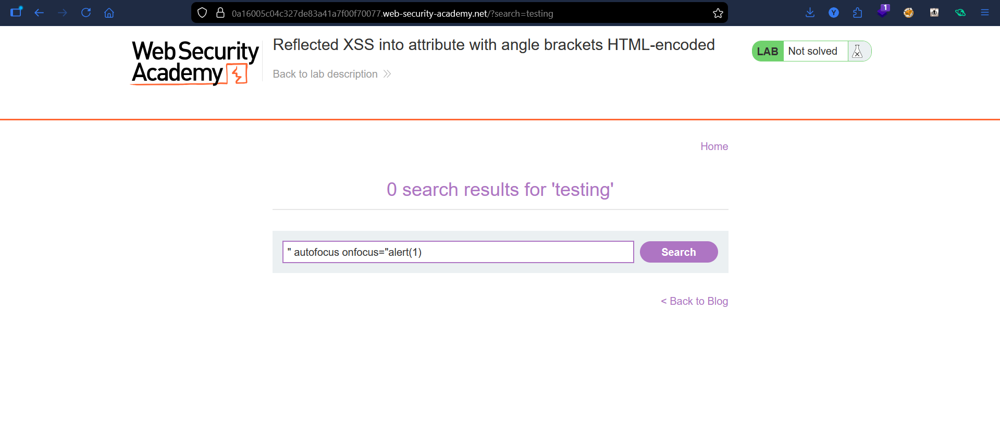
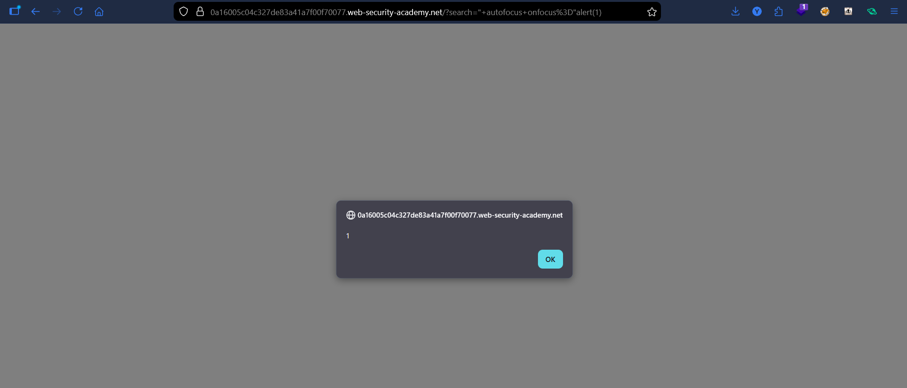

# Lab: Reflected XSS into Attribute with Angle Brackets HTML-Encoded

## Vulnerability
The `search` parameter is reflected into an HTML attribute value. Angle brackets (`<`, `>`) are HTML-encoded, preventing tag injection — but attribute-breaking via quotes is still possible, allowing injection of new event handler attributes.

## Exploit

### Step 1 — Identify injection point
Entered test string in search:
```
testing
```
Inspected the page source in browser DevTools and found the value reflected inside an HTML attribute:
```html
<input value="testing">
```

### Step 2 — Confirm angle brackets are blocked
Submitted:
```

```
Observed in DevTools that `<` and `>` were encoded as `&lt;` and `&gt;` — tag injection is not viable.

### Step 3 — Break out of the attribute
Since the value lands inside a quoted attribute, injecting a `"` breaks out of it:
```
" autofocus onfocus="alert(1)
```
This transforms the rendered HTML into:
```html
<input value="" autofocus onfocus="alert(1)">
```

### Step 4 — Trigger the alert
The `autofocus` attribute automatically focuses the input on page load, which fires the `onfocus` event handler — executing `alert(1)` without any user interaction.

## Result
Successfully executed JavaScript via reflected XSS by injecting into an HTML attribute context.

## Key Point
- Angle brackets are HTML-encoded → direct tag injection is blocked
- The value is reflected inside a **quoted attribute** → a `"` breaks out of the attribute context
- Event handlers (`onfocus`, `onmouseover`, etc.) can be injected as new attributes
- `autofocus` + `onfocus` triggers execution automatically on page load
- No `<script>` tags or angle brackets needed

## Proof



