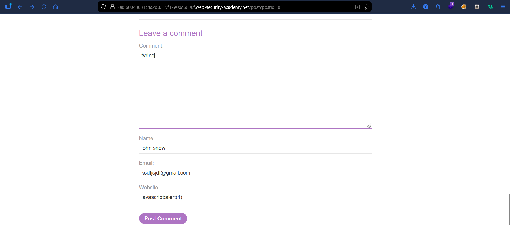
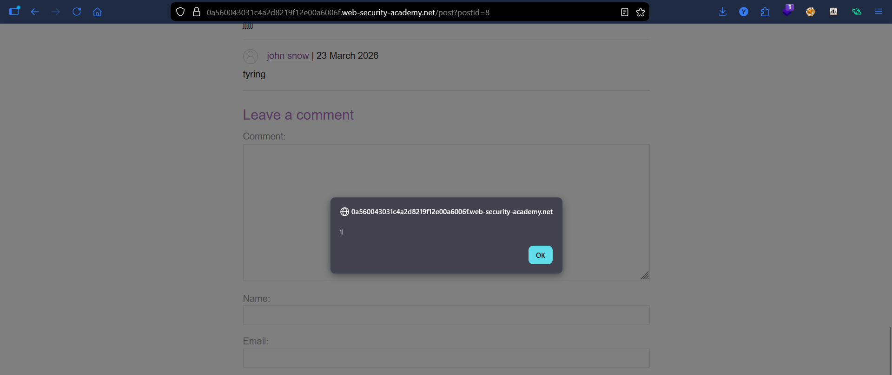

# Lab: Stored XSS into Anchor `href` Attribute with Double Quotes HTML-Encoded

## Vulnerability
The **Website** field in the comment form is stored and reflected inside an `<a href="...">` tag. Double quotes are HTML-encoded, but the `href` attribute accepts `javascript:` URIs — executing JavaScript when the author name is clicked.

## Exploit

### Step 1 — Identify the injection point
Submitted a comment and inspected the author name in DevTools. Found it rendered as:
```html
<a href="https://example.com">john snow</a>
```

### Step 2 — Inject `javascript:` URI
Submitted a new comment with the Website field set to:
```
javascript:alert(1)
```

### Step 3 — Trigger the payload
Navigated back to the blog post and clicked the author name → `alert(1)` fired.

## Result
Successfully executed JavaScript via stored XSS using a `javascript:` URI in an `href` attribute.

## Key Points
- Double quotes are encoded → attribute breaking is blocked
- `href` accepts `javascript:` protocol → no angle brackets needed
- Payload is **stored** — executes for every user who clicks the author name

## Proof



