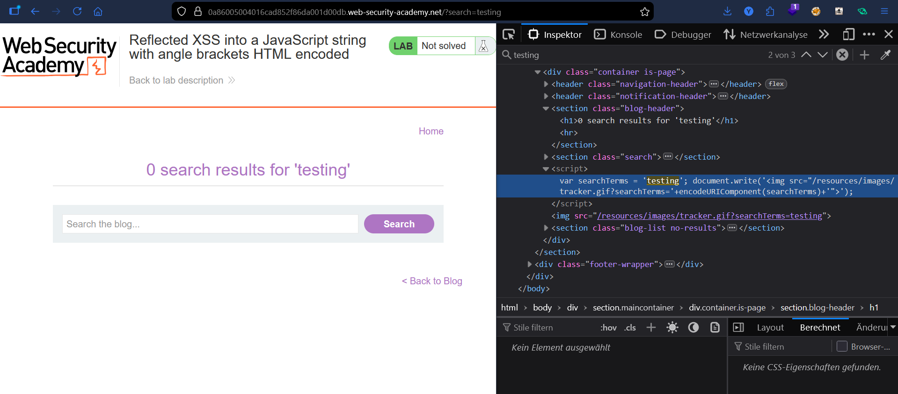
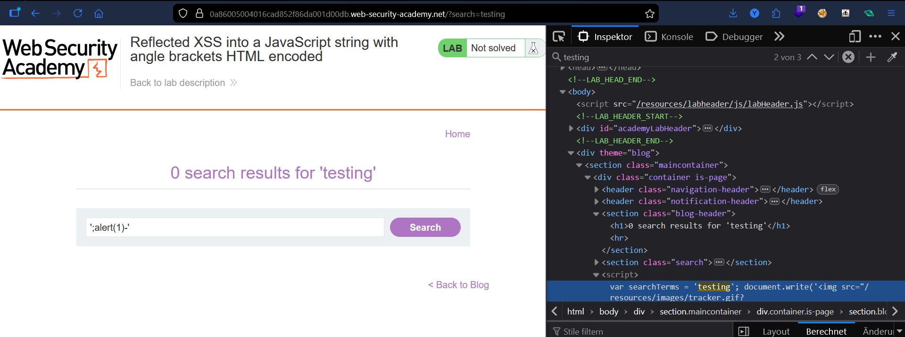
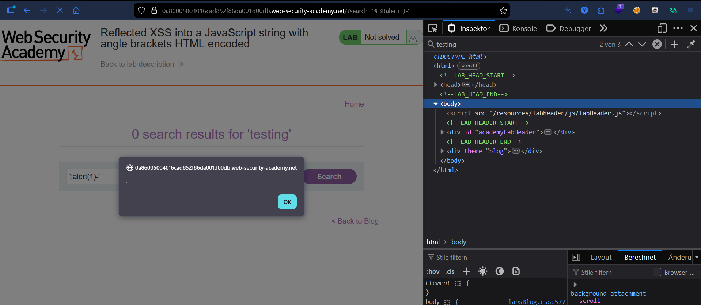

# Lab: Reflected XSS into a JavaScript String with Angle Brackets HTML-Encoded

## Vulnerability
The search term is reflected inside a JavaScript string in a `<script>` block. Angle brackets are HTML-encoded, blocking tag injection — but single quotes are not escaped, allowing a break out of the JS string.

## Exploit

### Step 1 — Identify the injection point
Searched for `testing` and inspected the source in DevTools. Found the input reflected inside a JS variable:
```javascript
var searchTerms = 'testing';
```

### Step 2 — Break out of the string
Submitted the payload:
```
';alert(1)-'
```
This transforms the script into:
```javascript
var searchTerms = '';alert(1)-'';
```
The string closes, `alert(1)` executes, and the trailing `-''` keeps the syntax valid.

### Step 3 — Alert fired
Page loaded and `alert(1)` popped immediately.

## Result
Successfully executed JavaScript by breaking out of a JS string context via an unescaped single quote.

## Key Points
- Angle brackets are encoded → HTML/tag injection is blocked
- Single quotes are **not** escaped → JS string escape is possible
- `'` closes the string, `;` starts a new statement, `alert(1)` executes
- The XSS happens inside a `<script>` block, not in HTML

## Proof



