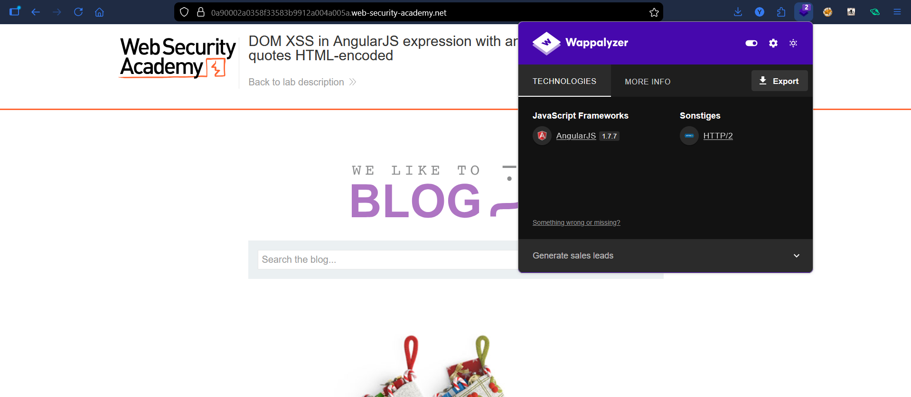
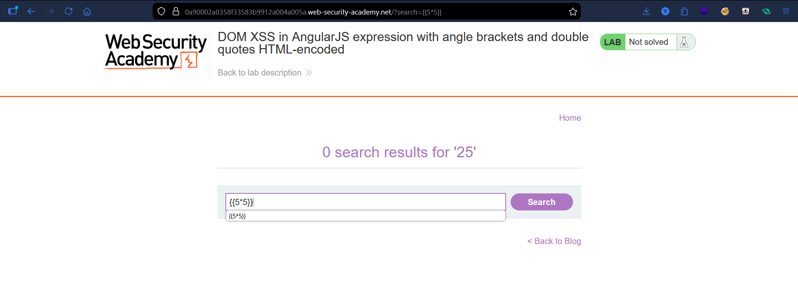
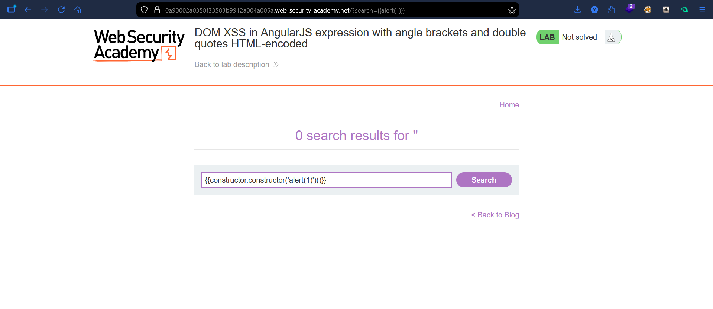
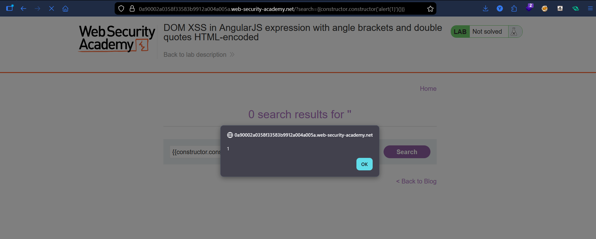

# Lab: DOM XSS in AngularJS Expression with Angle Brackets and Double Quotes HTML-Encoded

## Vulnerability
The search functionality reflects user input inside an AngularJS template on a page using `ng-app`. Angle brackets and double quotes are encoded, blocking standard XSS — but AngularJS evaluates `{{ }}` expressions, allowing JavaScript execution without any HTML tags.

## Exploit

### Step 1 — Fingerprint the technology
Opened Wappalyzer and confirmed the page runs **AngularJS 1.7.7** — meaning `{{ }}` expressions will be evaluated.

### Step 2 — Confirm the injection point
Typed in the search box to test if AngularJS processes the input:
```
{{5*5}}
```
Page showed **25** instead of `{{5*5}}` → AngularJS is executing expressions from user input ✅

### Step 3 — Inject the payload
Since direct `{{alert(1)}}` is sandboxed, used the constructor escape to reach the `alert` function:
```
{{constructor.constructor('alert(1)')()}}
```

### Step 4 — Alert fired
Submitted the payload → `alert(1)` executed immediately.

## Result
Successfully executed JavaScript via AngularJS template injection without using any HTML tags or angle brackets.

## Key Points
- `ng-app` on the page → AngularJS evaluates `{{ }}` as JavaScript expressions
- Angle brackets and quotes are encoded → standard HTML injection is blocked
- `{{alert(1)}}` is blocked by the AngularJS sandbox
- `constructor.constructor('...')()` escapes the sandbox by creating a new `Function` from a string
- No HTML tags needed — the entire attack lives inside `{{ }}`

## Proof




