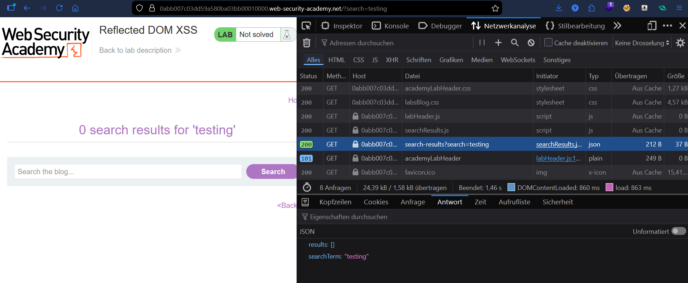
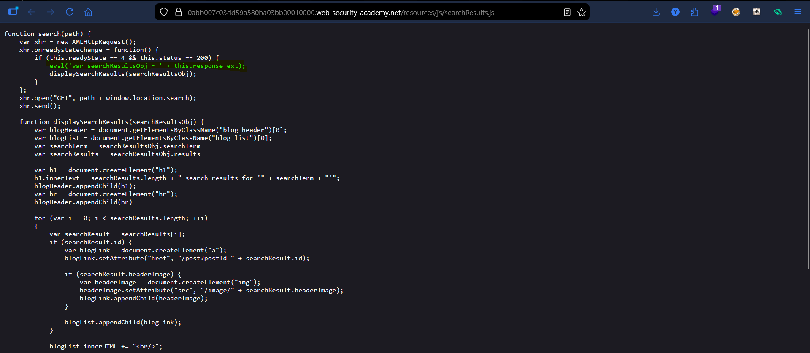
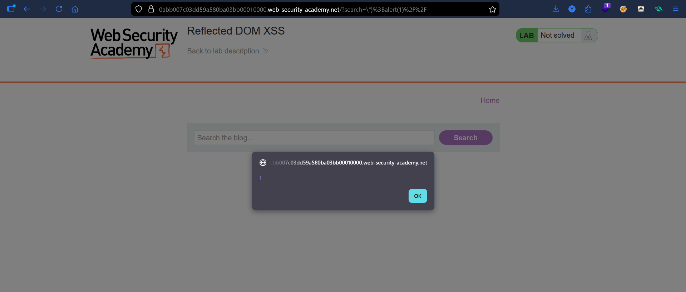

# Lab: Reflected DOM XSS

## Vulnerability
The search box sends your input to the server, which sends it back as JSON. The page then takes that JSON and runs it through `eval()` — a function that executes anything you give it as JavaScript. Since your input is part of what gets evaluated, you can inject your own code.

## Exploit

### Step 1 — Find where the input goes
Searched for `testing` and opened **DevTools → Network tab**. Found that the server sends back:
```json
{"results":[],"searchTerm":"testing"}
```
Our search term comes back inside this JSON response.

### Step 2 — Find the dangerous code
Opened `searchResults.js` and found this line:
```javascript
eval('var searchResultsObj = ' + this.responseText);
```
So `eval()` is literally running our input as code. That's the problem.

### Step 3 — Break out and inject
Our input sits inside a JSON string like this:
```javascript
var searchResultsObj = {"results":[],"searchTerm":"OUR INPUT HERE"}
```
We need to escape that and inject our own code. The payload:
```
\"};alert(1)//
```
- `\"` → closes the JSON string (the `\` is needed so JSON accepts it)
- `}` → closes the JSON object
- `;alert(1)` → our code runs here
- `//` → hides the leftover junk after our payload

So eval ends up running:
```javascript
var searchResultsObj = {"results":[],"searchTerm":"\"};alert(1)//"}
```
Which executes `alert(1)` ✅

### Step 4 — Alert fired
Typed the payload in the search box → alert popped immediately.

## Key Points
- `eval()` is dangerous because it runs any string as real JavaScript
- Our input was inside JSON, so we needed `\"` to escape it properly first
- `\` is for the JSON layer — without it, the JSON breaks before eval even sees it
- `//` at the end comments out any leftover characters so the code stays valid

## Proof




