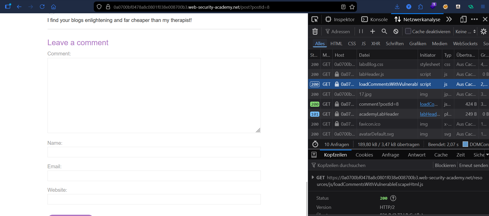
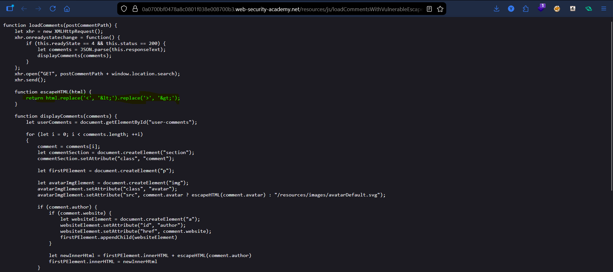
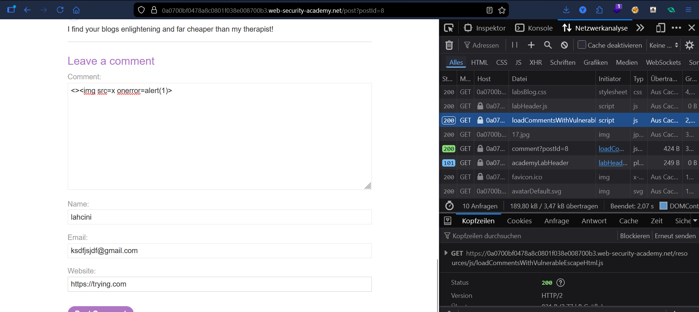

# Lab: Stored DOM XSS

## Vulnerability
The comment section loads stored comments using a JavaScript file called `loadCommentsWithVulnerableEscapeHtml.js`. It has a broken `escapeHTML` function that only escapes the **first** `<` and `>` it finds. After that, any remaining HTML tags go through raw into `innerHTML` — the sink.

## Exploit

### Step 1 — Find the vulnerable script
Opened the blog post and checked **DevTools → Network tab**. Found two important requests:
- `loadCommentsWithVulnerableEscapeHtml.js` — the script that handles comments
- `comment?postId=8` — the stored comments in JSON format

### Step 2 — Understand the flaw
The `escapeHTML` function inside the script:
```javascript
function escapeHTML(html) {
    return html.replace('<', '&lt;').replace('>', '&gt;');
}
```
`.replace()` in JavaScript only replaces the **first match** — so only the first `<` gets escaped. Any `<` after that goes through unescaped directly into `innerHTML`.

### Step 3 — Craft the payload
Put a dummy `<>` at the start to get consumed by the broken escaper, then the real payload after it:
```
<>
```
- `<>` → gets escaped → harmless ✅
- `` → goes through raw into `innerHTML` → executes ✅

Posted this as a comment in the **Comment** field.

### Step 4 — Alert fired
Navigated back to the blog post — the comment loaded, `onerror` triggered, `alert(1)` popped immediately.

## Result
Successfully executed JavaScript via stored DOM XSS by bypassing a broken HTML escape function.

## Key Points
- The `escapeHTML` function only escapes the **first** `<` and `>` — everything after is unprotected
- `innerHTML` is the **sink** — it interprets raw HTML including event handlers
- The fix for this would be to use `.replaceAll()` instead of `.replace()`
- This is **stored XSS** — the payload is saved in the database and fires for every user who views the post

## Proof




