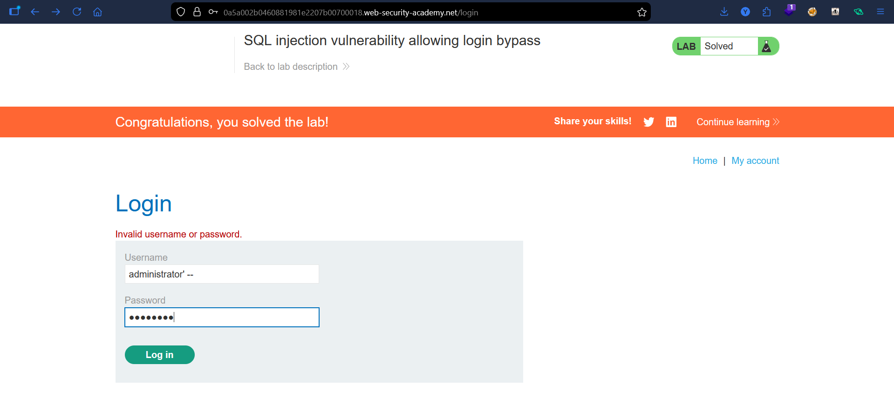
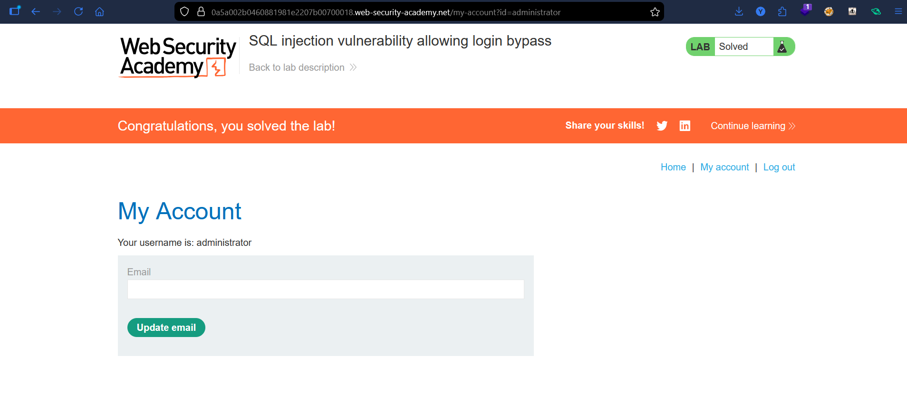

# Lab: SQL Injection Login Bypass

## Vulnerability
The login form uses user input directly in a SQL query without proper validation.

## Exploit
Modified the username field:

administrator'--

- `--` -> comments out the password check

## Result
Logged in successfully as the administrator without a valid password.

## Key Point
User input is not properly handled, allowing bypass of authentication.

## Proof

*password can be anything*

